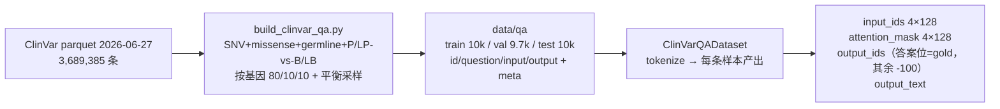
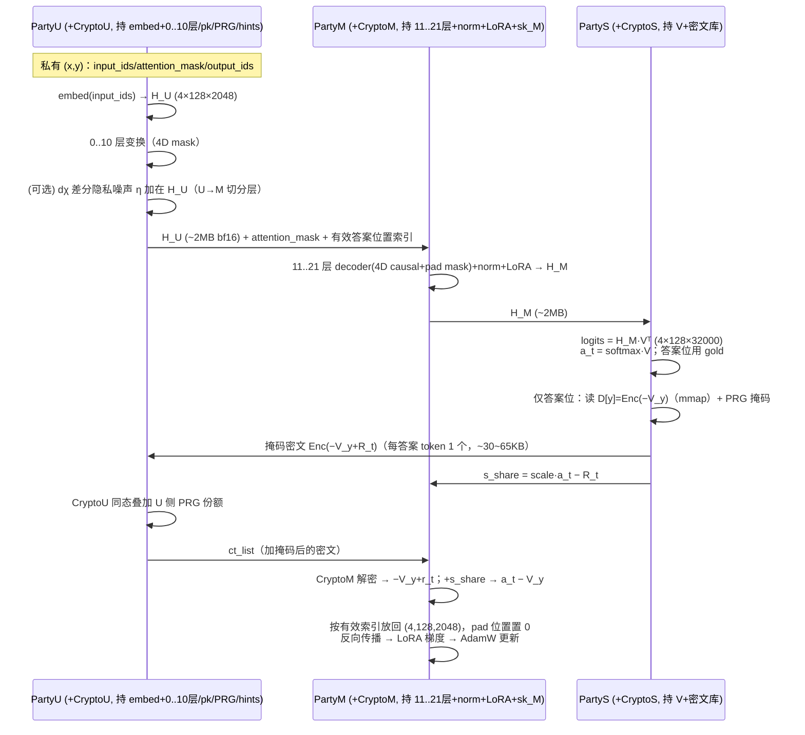

# CipherForge × ClinVar 变异致病性二分类：加密微调迁移方案

> 日期：2026-08-18
> 数据：`clinvar_plain/data/qa/`（5k/类明文基线，train 10,000 / val 9,708 / test 10,000，BioTriplex QA 契约 `id/question/input/output`）
> 模型：TinyLlama-1.1B-Chat-v1.0（本地缓存 snapshot；`lm_head.weight` 32000×2048，untied）
> 对标：明文基线 AUPRC **0.792** / AUC 0.794 / Acc 0.722

---

## 1. 目标与约束

在 CipherForge 三阶段协议（Stage 0 BFV 密文库 + S3PIR hints；Stage 1 U/M/S 三方 LoRA 微调；Stage 2 明文评估）下，用 5k/类 ClinVar QA 数据对 TinyLlama 做隐私微调。精度对标明文 0.792；单机 RTX 4060 8GB 可跑通冒烟与正式流程；BFV 定点误差不显著拉低 AUPRC。

## 2. 代码扫描结论

### 2.1 可直接复用
| 组件 | 说明 |
|---|---|
| `src/scripts/finetune.py` 通用入口 | 支持 `--config <json>` 覆盖全部参数；Stage 0/1/2 齐备 |
| `src/data/dataset.py::BioTriplexQADataset` | 契约 `id/question/input/output`，纯文本模板 `question\n\ninput`（无 Llama-3 特殊 token，TinyLlama 原生兼容） |
| `_load_V_for_db()` | 只读 `lm_head.weight`；TinyLlama untied，键名/形状已验证 `(32000, 2048)` |
| `bfv_privselect_v2_adapter.py` | 已有 N=2048 分支（coeff [36,14]），hidden 2048 恰好单密文/行 |
| `party_u/m/s` + `heterogeneous_protocol` | 三方前向、PIR 取行、`a_t − V_y` 梯度代理、LoRA 更新 |
| `Trainer` | `val_metric="val_ce_loss"` 可用（`_is_best` 对非 f1 指标取最小） |
| `save_peft_adapter()` | M 端 LoRA → 标准 PEFT adapter，供 Stage 2 加载 |
| `evaluate_auprc.py` | 本项目已有，直接做 Stage 2 的 AUPRC 评测 |

### 2.2 必须迁移/修改
| 项 | 现状 | 改法 |
|---|---|---|
| 模型参数 | 默认 8B/128256/4096/N=4096 | `--config` 覆盖：vocab 32000、hidden 2048、poly_degree 2048、**u_layers 11 / m_layers 11**（22 层对半切分：U 持 embed+0..10 层，M 持 11..21 层+norm+LoRA） |
| hints 归属 | 现代码在 Stage 0 生成、文档标注 S 侧持有 | 按 S3PIR 语义修正为 **U 生成并持有**（客户端预处理：查询构造+应答解码）；Design-2 下 S 只需密文库，无需 hints |
| 数据适配 | `BioTriplexQADataset` 不产出 `output_ids`（协议需要） | 新增 `ClinVarQADataset`：`output_ids` 只在答案位置放 gold token、其余（prompt/pad）置 -100 |
| #9 attention_mask | `party_u/m` 已传 mask，但 `model_splitting` 的 U/M shard 把 `attention_mask=None` 传给每层 | shard 内构造 4D causal+padding mask 传入 `LlamaDecoderLayer` |
| #8 gold_ids 负索引 | `party_s.process_logits_dispatch` 对 `gold_ids` 直接 flatten 不滤 -100 | -100 位置回退 argmax，并输出"有效答案位置索引" |
| #14 全位置 PIR | 每个 (B×S) token 都跑 PIR/解密 | 只对有效答案位置跑 PIR/解密/梯度注入（本任务每样本仅 1 个答案 token） |
| Stage 2 评估 | `evaluate_biotriplex.py` 是 BioTriplex 字母/NER 指标 | 换成 `evaluate_auprc.py`（Yes/No softmax → AUPRC） |
| val 指标 | `_run_val_epoch` 硬算字母级 F1 | `val_metric="val_ce_loss"` 即可选最优；可选加 `task_type="clinvar"` 分支算二元准确率 |
| 训练超参 | 8B 默认 lr 3.5e-4、epoch 10 | lr 2e-4、epoch 3、warmup 100、batch 4、max_seq_length 128 |

### 2.3 明确不需要动
- `biotriplex_dataset.py`（Llama-3 chat 模板路径）——不走它；
- tied embeddings 处理——TinyLlama untied，U 端 embed 与 S 端加密的 V（lm_head）天然分离；
- 三机网络总线——本阶段单机 `HeterogeneousProtocol` 即可，多机是后续可选项。

## 3. 迁移改动清单（按文件）

### 3.1 新增 `configs/clinvar_tinylama_he_pir.json`
```json
{
  "hf_model": "C:/Users/Chang/.cache/huggingface/hub/models--TinyLlama--TinyLlama-1.1B-Chat-v1.0/snapshots/<hash>",
  "bfv_cache_dir": "E:/desktopE/CipherForge/CipherForgeCode/SLG-HE-PIR/checkpoints/clinvar_bfv_cache",
  "data_dir": "E:/desktopE/CipherForge/CipherForgeCode/SLG-HE-PIR/clinvar_plain/data/qa",
  "project_root": "E:/desktopE/CipherForge/CipherForgeCode/SLG-HE-PIR",
  "checkpoint_dir": ".../clinvar_ckpts/checkpoints",
  "log_dir": ".../clinvar_ckpts/logs",
  "vocab_size": 32000,
  "hidden_dim": 2048,
  "poly_degree": 2048,
  "plain_bits": 30,
  "scale": 10000,
  "lam": 80,
  "u_layers": 11,
  "m_layers": 11,
  "max_seq_length": 128,
  "max_epochs": 3,
  "batch_size": 4,
  "learning_rate": 0.0002,
  "weight_decay": 0.01,
  "warmup_steps": 100,
  "val_metric": "val_ce_loss",
  "use_flash_attention": false,
  "use_sage_attention": false,
  "use_deepspeed_zero": false,
  "gradient_checkpointing_style": "reentrant",
  "USE_CHUNKED_PIPELINE": true,
  "CHUNK_TOKENS": 128,
  "N_CRYPTO_U_WORKERS": 8,
  "N_CRYPTO_M_WORKERS": 8,
  "N_CRYPTO_S_WORKERS": 1,
  "seed": 42
}
```

### 3.2 新增 `src/data/clinvar_dataset.py`
```text
load_clinvar_dataset(data_dir) -> train/val/test samples   # 复用 load_biotriplex_dataset 的 JSONL 读取
ClinVarQADataset(samples, tokenizer, max_length=128):
  prompt  = f"{question}\n\n{input}\n\nAnswer:"
  input_ids = tokenize(prompt) + tokenize(" " + output)     # 截断保答案
  attention_mask = 1 对真实 token，0 对 pad
  output_ids = [-100]*len(prompt) + answer_ids + [-100]*pad
  output_text / labels 同 output_ids
```

### 3.3 正确性修复（P0，三个文件）
1. `src/model/model_splitting.py`：U/M shard `forward` 用 attention_mask 构造 4D causal mask 传入 `LlamaDecoderLayer`（GC 分支同样传 mask），pad 位置不参与 attention；
2. `src/parties/party_s.py`：`process_logits_dispatch` 中 `gold_ids != -100` 才用 gold，否则回退 argmax；返回有效位置索引 `valid_idx`；
3. `src/parties/party_m.py`：`backward_and_update` 只对 `valid_idx` 注入梯度，pad 位置置零；loss 代理只统计有效位置。

> 修复前不要跑正式训练：全位置 PIR + 负索引取行会导致训练语义错误。

### 3.4 新增 `src/scripts/finetune_clinvar.py`
基于 `finetune.py` 复制改造：
- Stage 0：不变（`build_encrypted_db` + `build_s3pir_hints`）；
- Stage 1：数据集用 `ClinVarQADataset`；`val_metric="val_ce_loss"`；其余走 `HeterogeneousProtocol`；
- Stage 2：加载 `adapter_dir` 的 PEFT adapter，调 `clinvar_plain/scripts/evaluate_auprc.py` 输出 AUPRC/AUC/acc + 按基因。

### 3.5 评估
Stage 2 产物 = 明文 `metrics.json`，与基线 0.792 直接对比；必要时加 `--dp_enable` 做 dχ 隐私消融。

## 4. 迁移后完整流程（命令级）

```powershell
$py='D:\anaconda3\envs\gfxxxh_gpu\python.exe'
cd E:\desktopE\CipherForge\CipherForgeCode\SLG-HE-PIR

# ── Stage 0：离线构建（一次）──
& $py -s src\scripts\finetune_clinvar.py --config configs\clinvar_tinylama_he_pir.json --stage 0
#   密文库：32,000 行 × 1 密文/行（N=2048）≈ 1~2GB；SEAL 单机约 0.5~2h

# ── 冒烟：10 步验证（先修复 P0 后）──
& $py -s src\scripts\finetune_clinvar.py --config configs\clinvar_tinylama_he_pir.json --stage 1 --max_train_steps 10

# ── Stage 1：正式三方微调（3 epochs）──
& $py -s src\scripts\finetune_clinvar.py --config configs\clinvar_tinylama_he_pir.json --stage 1
#   每步只对答案 token（batch 4 → 4 次 PIR/解密）；GPU 前向 U(embed)+M(22层) 分片 ~2.2GB，8GB 卡可行

# ── Stage 2：明文评估 ──
& $py -s src\scripts\finetune_clinvar.py --config configs\clinvar_tinylama_he_pir.json --stage 2
#   输出 AUPRC/AUC/Acc，对标明文 0.792
```

三机部署（可选）：`legacy_ipc_stub`/`QueueBus` → RPC bus（接口已预留），U=embed、M=22 层+LoRA+sk_M、S=密文库。

## 5. 风险与预期

1. **正确性优先**：#8/#9/#14 未修前不跑正式训练；修复后用 `e2e_math_verify`/`heterogeneous_correctness_test` 做单步数值对照；
2. **BFV 定点误差**：scale=10000、plain_bits=30 下 `a_t − V_y` 的量化误差可能影响梯度代理；若 AUPRC 与 0.792 差距 >0.02，调 scale/plain_bits 或做精度消融；
3. **速度**：CPU 密码学是瓶颈；先并行化 worker 池（已知 #1），answer-token-only 后 3 epochs 预计数小时量级；
4. **显存**：U/M 分片各约 1.1GB bf16 + LoRA + 激活，单卡 <8GB；S 密文库 1~2GB 走内存/mmap；
5. **数据契约**：Stage 2 的 adapter 由 `save_peft_adapter` 导出，与 `evaluate_auprc.py` 兼容。

## 6. 执行顺序与工作量

1. config JSON + `clinvar_dataset.py` + `finetune_clinvar.py` 骨架（0.5 天）；
2. 修复 #9 → 框架前向与 HF 前向数值一致对照（0.5 天）；
3. 修复 #8/#14 → 单步数学验证（0.5~1 天）；
4. Stage 0 构建 + 10 步冒烟 + 2-epoch 小验证（0.5~1 天）；
5. 全量 3 epochs + Stage 2 AUPRC 对标 + 报告（1 天）。

总计约 3~4 天（含调试）。改动集中在 4~6 个文件、约 300~500 行。

## 7. 迁移后各阶段数据流动（详细）

### 7.0 数据准备（Stage 1 启动前，离线）



每条样本：`prompt = question\n\ninput\n\nAnswer:` + `" Yes"/" No"`；截断策略保答案、裁 prompt 头；pad 用 eos；`output_ids` 只保留答案位置的 gold token id（`Yes`/`No` 各 1 个 token），prompt 与 pad 全部 -100。

### 7.1 Stage 0：BFV 密文库 + S3PIR hints（离线一次）

```mermaid
flowchart LR
  V[lm_head.weight<br/>V: 32000×2048 float64] --> E[build_encrypted_db.py<br/>定点编码 scale=10000<br/>逐行 BFV 加密 N=2048]
  CFG[config: N=2048<br/>plain_bits=30<br/>vocab=32000] --> E
  E --> DB[密文库 D[y] = Enc(−V_y)<br/>y = 0..31999<br/>~1~2GB 文件 + bfv_pk.bin]
  DB --> H[build_s3pir_hints.py<br/>HintTable n=32000<br/>partition=128, lam=80<br/>main+backup parities]
  SK[sk_M：修复 #10 后<br/>持久化到受保护文件 0600] --> M0[仅 M 侧持有]
  H --> U0[U 侧生成并持有 hints<br/>客户端预处理，用于查询构造/应答解码]
```

产物归属：密文库 + pk → **S 侧**；hints → **U 侧**（U 生成并持有；Design-2 下 S 只需密文库）；sk_M → **M 侧**。

### 7.2 Stage 1：单步三方训练数据流（修复 #8/#9/#14 后）



单步数据量（batch=4, seq=128, hidden=2048, bf16）：

| 数据 | 大小 | 方向 |
|---|---|---|
| input_ids / attention_mask | ~4KB | U 内部 |
| H_U / H_M | 各 ~2MB | U→M、M→S |
| logits（瞬时 GPU） | 4×128×32000 fp32 ≈ 65MB | S 内部 |
| BFV 密文（仅答案位） | 4 × 30~65KB ≈ 120~260KB | S→U→M |
| s_share | 4 × 2048×int64 ≈ 64KB | S→M |
| LoRA 梯度/优化器 | 6.31M 参数级 | M 内部 |

隐私边界（迁移后不变）：U 看不到 V 明文与 sk_M；M 看不到 (x,y) 明文与 V；S 看到 H_M、logits 与 gold ids（Design-2 已知限制，P3 审计已记录），看不到输入文本。

> **为什么答案位用 gold、其余位置（prompt/pad）不参与？**
> 协议每 token 的训练信号是梯度代理 `g_t = a_t − V_{y_t}`。答案位置有监督标签，必须用 gold（PIR 取 `V_gold`），这正好等于明文 CE 损失对隐藏层的梯度 `∂L/∂h = softmax(z)·V − V_gold`。prompt 位置没有标签：原 BioTriplex 设计用 argmax 作为"无标签目标"（label-free 自蒸馏，让模型在 prompt 上也能学习），但代价是每个 prompt token 都要跑一次 PIR。我们的 ClinVar 任务语义上只需要答案 token 的监督，因此**prompt/pad 位梯度置零、不取密文行**——每步 PIR 次数 = batch 内答案 token 数（=batch size），且与 CE 梯度完全一致；如想额外做自蒸馏正则，可加开关"prompt-argmax"（代价：PIR 次数回到序列长度）。验证/生成场景下 S 用 argmax 只是"无 gold 时的预测回退"，与训练语义无关。

### 7.3 Stage 1：校验步数据流

与训练步前向相同（U→M→S 计算 logits），但**不跑 PIR/解密**：S 把每个样本答案位置的 `Yes`/`No` logits 返回，U 端本地算 val_ce_loss（与二元准确率，可选）；Trainer 按 `val_metric="val_ce_loss"` 决定最优 checkpoint。校验不更新任何参数。

### 7.4 Stage 2：明文评估数据流

```mermaid
flowchart LR
  M -->|gather_checkpoints 的 lora_state| SA[save_peft_adapter<br/>→ PEFT adapter 目录]
  SA --> EV[evaluate_auprc.py]
  Q2[data/qa/test.jsonl 10k] --> EV
  EV --> EV2[prompt 无答案 → 最后真实 token<br/>Yes/No logits → softmax → P(Yes)]
  EV2 --> R[metrics.json<br/>AUPRC/AUC/Acc + 按基因<br/>+ 零样本/多数类基线]
  R --> C[对标明文 0.792]
```

Stage 2 全程明文、无 BFV/PIR，用于产出可与基线直接对比的最终指标。

## 8. 端到端数学一致性验证（加密微调 ≡ 明文 LoRA 基线）

### 8.1 符号

- `x`：输入序列（长度 S）；`t*`：答案位置；`y*`：答案 gold token；
- `E`：embed（U）；`L0..L10`（U）、`L11..L21 + norm`（M）；`V`：lm_head 32000×2048（S 持明文）；
- `d=2048`、`scale=10000`、BFV 明文模 `p≈2^30`；PRG 掩码 `R_t`（U/S 共享种子，逐 (step, token) 一致）。

### 8.2 明文基线（CE 损失）

1. `h = norm(L21(...L0(E(x))...))`
2. `z = h·Vᵀ`，`π = softmax(z)`
3. `L = −log π[t*, y*]`
4. 隐藏层梯度：`∂L/∂h_t = δ_{t=t*}·(π[t*]·V − V[y*]) = δ_{t=t*}·(a[t*] − V[y*])`
5. 参数梯度 = `backprop(h, g)`，其中 `g` 只在答案位置非零。

### 8.3 加密协议（修复后、DP 关闭）

1. U 算 `h_U = L10(...L0(E(x))...)`；M 算 `h = norm(L21(...L11(h_U)...))` —— 与 8.2 的 `h` 逐元素相等（前提 P1）；
2. S 用同一 `H_M` 与自己的 `V` 算 `z、π、a_t`（数值与明文完全相同，前提 P2）；
3. 答案位 `t*`：
   - S：`s_share = round(scale·a[t*]) − R[t*]`；从密文库取 `Enc(−round(scale·V[y*]))`；
   - U：同态加掩码 → `Enc(−round(scale·V[y*]) + R[t*])`；
   - M：解密 → `(−round(scale·V[y*]) + R[t*]) mod p`；加 `s_share` →
     `round(scale·a[t*]) − round(scale·V[y*]) ≈ scale·(a[t*] − V[y*])`（前提 P4 无回绕）；
   - M：`÷scale` → `ĝ ≈ a[t*] − V[y*]`，逐元素误差 `≤ 1/(2·scale) ≈ 5e-5`；
4. M 把 `ĝ` 放回 `t*` 位、其余位置 0，沿 M→U 反传 → 参数梯度 = 明文梯度 + 有界定点误差；
5. LoRA 更新规则（AdamW、LoRA r=8/α=16）两侧一致。

### 8.4 结论与前提

**结论**：无限精度下，加密协议每步的 LoRA 梯度与明文 CE 基线逐元素相等；有限精度下仅差定点量化（`≤ 1/(2·scale)`），可由单步 e2e 数值对照验证。

前提清单（全部需要落地验证）：
- **P1 前向一致**：u=11/m=11 连续覆盖 0..21+norm、修复 #9（mask 真正进层）、RoPE/position_ids/bf16/dropout 一致 → `e2e_math_verify.py`/`heterogeneous_correctness_test.py` 断言；
- **P2**：S 的 V 与明文基线同一 `lm_head.weight`；
- **P3**：PRG 掩码 U/S 逐位一致（同一 seed + 相同计数器约定），否则掩码不抵消；
- **P4**：`|scale·a − scale·V_y| < p/2`（p≈2^30、scale=1e4 满足；代码做有符号中心化）；
- **P5**：BFV 解密噪声在 N=2048 单次加掩码（浅电路）下可忽略；
- **P6**：gold 只在答案位（output_ids 掩码正确），prompt/pad 梯度置零（#8/#14）；
- **P7**：DP 关闭时无额外扰动；开启 dχ 时对比对象是"同样加噪的明文 DP 基线"。
- **P8**：LoRA 位置一致——协议端 LoRA 只在 M 的 11 层；明文对照基线必须同样只在层 11..21 挂 LoRA（我们现有 0.792 基线是全部 22 层 LoRA，用作对照需另跑一个 M-only-LoRA 版本，或扩展协议支持 U 侧 LoRA）。

> 说明：一致性主张的是"**单步梯度**在数学上相等"；由于 batch 大小/梯度累积等训练配置可能不同，优化轨迹不一定逐点重合，这不影响逐步梯度等价的结论。

### 8.5 验证手段

单步对照：同一 batch 分别跑明文参考（标准 CE 反传）与加密协议，比较 LoRA 更新前后的梯度（余弦相似度 + 最大绝对误差），并断言解密值在容差内；仓库已有 `e2e_math_verify.py` 可直接复用改造。
